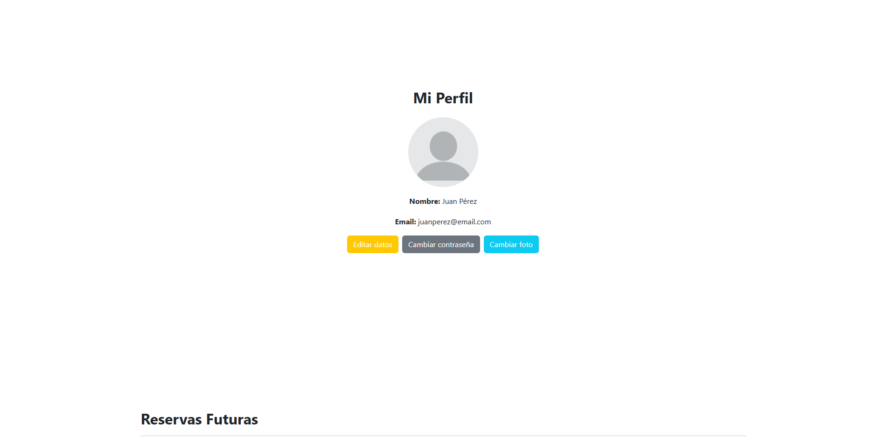
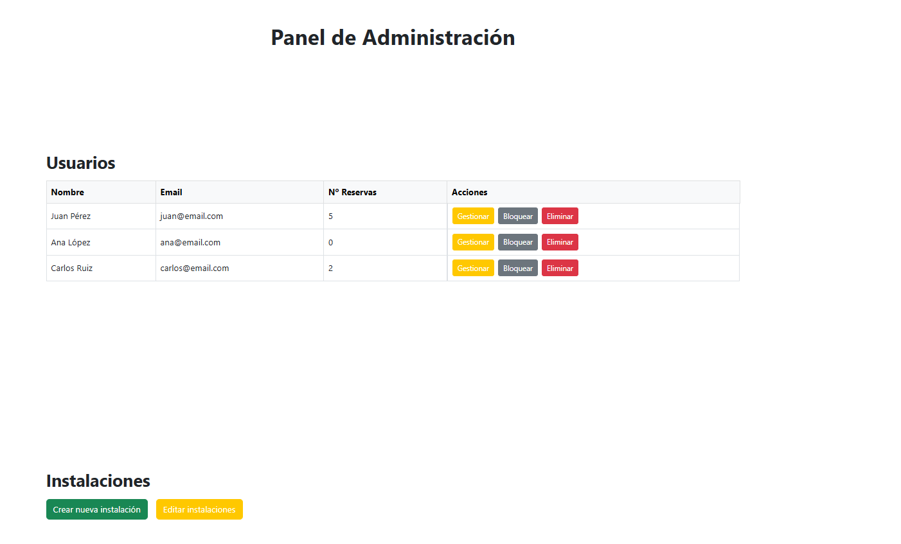

# Olympo Academy

## 👥 Miembros del Equipo
| Nombre y Apellidos | Correo URJC | Usuario GitHub |
|:--- |:--- |:--- |
| Adrián Bellon | a.bellon.2024@alumnos.urjc.es | pi0lin |
| Javier González | j.gonzaleza.2024@alumnos.urjc.es | Batcat248 |
| Lucia Zapata | l.zapata.2024@alumnos.urjc.es | Luxx67 |
| Diego Consuegra | d.consuegra.2024@alumnos.urjc.es | K0nzu |

---

## 🎭 **Preparación: Definición del Proyecto**

### **Descripción del Tema**
Our application is a website for a sports academy called Olympo Academy. The goal of the application will be to manage reservations for the facilities chosen by users. It belongs to the sports sector. Some features that the application offers to users are: checking schedules, signing up for sports classes, or reserving facilities.

### **Entidades**

1. **[Entidad 1]**: User
2. **[Entidad 2]**: Space
3. **[Entidad 3]**: Reservation
4. **[Entidad 4]**: Rating

**Relaciones entre entidades:**
- User - Reservation: A user can make multiple reservations (1:N)
- Reservation - Space: A reservation has a space
- User - Rating: A user can make multiple ratings (1:N)

### **Permisos de los Usuarios**

* **Anonymous User**:
- Permissions: Viewing of different spaces, schedules, and records
- Is not the owner of any entity

* **Registered User**:
- Permissions: Manage profile, make reservations, leave reviews.
- Owns: Their own reservations, User Profile, Reviews

* **Administrator**:
- Permissions: Full product management, statistics viewing, content moderation
- Owns: Spaces, reviews, can manage bookings and Users

### **Images**
- **[Entidad con imágenes 1]**: User - One avatar image per user
- **[Entidad con imágenes 2]**: Facilities - Multiple images per facility (gallery)


---

## 🛠 **Práctica 1: Maquetación de páginas con HTML y CSS**

### **Vídeo de Demostración**
📹 **[Enlace al vídeo en YouTube](https://www.youtube.com/watch?v=x91MPoITQ3I)**
> Video showing the main features of the web application.

### **Diagrama de Navegación**


> The user can access all sections from the homepage through the navigation bar/menu. An anonymous user will only have access to public pages and will not be able to access the admin panel or user profile. To access the user profile and, consequently, book classes/facilities, leave reviews, or edit their user profile, it is necessary to first register or log in on the respective page. Once logged in as an academy user, they will be able to carry out the activities mentioned above. On the other hand, the administrator can access their panel from the main page, where they can perform any privileged activity.

NOTE: Not all arrows have been added to the diagram, but from the admin panel you can access all the pages of the website.

### **Capturas de Pantalla y Descripción de Páginas**

#### **1. Pagina Principal/ Home**


> Homepage that displays information about the academy, its team and the available facilities. Includes a navigation bar and access to registration/login for unauthenticated users.

#### **2. Reseñas**


> User reviews/rating page. To add a new review, you must be logged in to the website with your credentials.

#### **3. Reservas**


> Booking page, only available to registered users. Allows you to book both a class and a facility.

#### **4. Login**


> Page that allows user authentication. It also has an option for anonymous users to register. It redirects to the main page since we don't know if the user wants to make a purchase or not.

#### **5. Registro**


> This page allows new users to become members, who will need to fill out a form with the requested information. Once registered, it redirects to the login page.

#### **6. Mi Perfil** 


> This page is only visible to registered users. It allows you to view and edit user information (email, password, etc.), manage your bookings, and your published reviews.

#### **7. Panel del Administrador**


> This section is only available to the admin user, who will log in like a regular user but, as an admin, will have certain privileges such as managing users and facilities.

### **Participación de Miembros en la Práctica 1**

#### **Alumno 1 - Javier González Alonso**

| Nº    | Commits      | Files      |
|:------------: |:------------:| :------------:|
|1| [Login page development](https://github.com/DWS-2026/project-grupo-10/commit/d44805e27d613523526033a1c20576fb72c97e14)  | [login.html](https://github.com/DWS-2026/project-grupo-10/blob/main/login.html)   |
|2| [Register page development](https://github.com/DWS-2026/project-grupo-10/commit/d44805e27d613523526033a1c20576fb72c97e14)  | [register.html](https://github.com/DWS-2026/project-grupo-10/blob/main/register.html)   |
|3| [Creation of the footer](https://github.com/DWS-2026/project-grupo-10/commit/46418d77fc11c0e1c08b88defa9678bfc68c2b9a)  | [index.html](https://github.com/DWS-2026/project-grupo-10/blob/main/index.html)   |
|4| [Creation of the images of the facilities](https://github.com/DWS-2026/project-grupo-10/commit/0a6fa19888e67c0d6651e7a0a111a97acb9bbcc4)  | [/clases/instalaciones](https://github.com/DWS-2026/project-grupo-10/tree/main/images/instalaciones)   |
|5| [General and background styles](https://github.com/DWS-2026/project-grupo-10/commit/1ce6b5705de2a4c65aaa158c4881f18a782f0548)  | [ourStyles.css](https://github.com/DWS-2026/project-grupo-10/blob/main/ourStyles.css)   |

---

#### **Alumno 2 - Lucía Zapata Fernández**

| Nº    | Commits      | Files      |
|:------------: |:------------:| :------------:|
|1| [Booking page development](https://github.com/DWS-2026/project-grupo-10/commit/54697668d9a4375536375073fecd5745ab0d829f)  | [reservas.html](https://github.com/DWS-2026/project-grupo-10/blob/main/reservas.html)   |
|2| [Booking page pop-ups creation](https://github.com/DWS-2026/project-grupo-10/commit/afe5cc623de0bb916315ffe9e2336ad66b57845a)  | [reservas.html](https://github.com/DWS-2026/project-grupo-10/blob/main/reservas.html)   |
|3| [Booking page pop-ups styles](https://github.com/DWS-2026/project-grupo-10/commit/afe5cc623de0bb916315ffe9e2336ad66b57845a)  | [ourStyles.css](https://github.com/DWS-2026/project-grupo-10/blob/main/ourStyles.css)   |
|4| [Creation of the team section in the index](https://github.com/DWS-2026/project-grupo-10/commit/6c839d38f80224cfd6d120b948c734a244c2ad53)  | [index.html](https://github.com/DWS-2026/project-grupo-10/blob/main/index.html)   |
|5| [Creation of the images of the facilities](https://github.com/DWS-2026/project-grupo-10/commit/cc177219d663bc50905794a697f654ea65a43664)  | [/clases/instalaciones](https://github.com/DWS-2026/project-grupo-10/tree/main/images/instalaciones)   |

---

#### **Alumno 3 - Diego Consuegra Sáez**

| Nº    | Commits      | Files      |
|:------------: |:------------:| :------------:|
|1| [Admin panel page development](https://github.com/DWS-2026/project-grupo-10/commit/866ffc7d3691e754930587d98fb864f2f92e6cda)  | [admin.html](https://github.com/DWS-2026/project-grupo-10/blob/main/admin.html)   |
|2| [User profile page development](https://github.com/DWS-2026/project-grupo-10/commit/d0ee38ea7754d0009ba5cfb17400afec637bc5ee)  | [userProfile.html](https://github.com/DWS-2026/project-grupo-10/blob/main/userProfile.html)   |
|3| [Admin page pop-ups creation](https://github.com/DWS-2026/project-grupo-10/commit/7ba798192c908967b03b7b93e60e4e6b5b349c10)  | [admin.html](https://github.com/DWS-2026/project-grupo-10/blob/main/admin.html)   |
|4| [User page pop-ups creation](https://github.com/DWS-2026/project-grupo-10/commit/79efad0a03fbd01d5c0a782da41949a806cb98e5)  | [userProfile.html](https://github.com/DWS-2026/project-grupo-10/blob/main/userProfile.html)   |
|5| [Admin page and user page pop-ups styles](https://github.com/DWS-2026/project-grupo-10/commit/28082dba2e3ca435079a5cca3ccca2bf9bb62620)  | [ourStyles.css](https://github.com/DWS-2026/project-grupo-10/blob/main/ourStyles.css)  |

---

#### **Alumno 4 - Adrián Bellón de la Cruz**

| Nº    | Commits      | Files      |
|:------------: |:------------:| :------------:|
|1| [Reviews page development](https://github.com/DWS-2026/project-grupo-10/commit/12f120103a8fdcbcf54eb520eeea9f9aaae44065)  | [reseñas.html](https://github.com/DWS-2026/project-grupo-10/blob/main/rese%C3%B1as.html)   |
|2| [Facilities description and photos added to index](https://github.com/DWS-2026/project-grupo-10/commit/376fc28be5334b15294239193eb1a47b2dd103a6)  | [index.html](https://github.com/DWS-2026/project-grupo-10/blob/main/index.html)   |
|3| [Creation of modals for the facilities that allow zooming in on the images in the index](https://github.com/DWS-2026/project-grupo-10/commit/6dd316d896e1afcb4a4df9401750187c943c9f6a)  | [index.html](https://github.com/DWS-2026/project-grupo-10/blob/main/index.html)   |
|4| [About us section creation with descriptions and logos](https://github.com/DWS-2026/project-grupo-10/commit/a1e93e61f75abea645f696f3afd8c93d1b1d17c3)  | [index.html](https://github.com/DWS-2026/project-grupo-10/blob/main/index.html)   |

---

## 🛠 **Práctica 2: Web con HTML generado en servidor**

### **Vídeo de Demostración**
📹 **[Enlace al vídeo en YouTube](https://www.youtube.com/watch?v=x91MPoITQ3I)**
> Vídeo mostrando las principales funcionalidades de la aplicación web.

### **Navegación y Capturas de Pantalla**

#### **Diagrama de Navegación**

Solo si ha cambiado.

#### **Capturas de Pantalla Actualizadas**

Solo si han cambiado.

### **Instrucciones de Ejecución**

#### **Requisitos Previos**
- **Java**: versión 21 o superior
- **Maven**: versión 3.8 o superior
- **MySQL**: versión 8.0 o superior
- **Git**: para clonar el repositorio

#### **Pasos para ejecutar la aplicación**

1. **Clonar el repositorio**
   ```bash
   git clone https://github.com/[usuario]/[nombre-repositorio].git
   cd [nombre-repositorio]
   ```

2. **AQUÍ INDICAR LO SIGUIENTES PASOS**

#### **Credenciales de prueba**
- **Usuario Admin**: usuario: `admin`, contraseña: `admin`
- **Usuario Registrado**: usuario: `user`, contraseña: `user`

### **Diagrama de Entidades de Base de Datos**

Diagrama mostrando las entidades, sus campos y relaciones:


> [Descripción opcional: Ej: "El diagrama muestra las 4 entidades principales: Usuario, Producto, Pedido y Categoría, con sus respectivos atributos y relaciones 1:N y N:M."]

### **Diagrama de Clases y Templates**

Diagrama de clases de la aplicación con diferenciación por colores o secciones:


> [Descripción opcional del diagrama y relaciones principales]

### **Participación de Miembros en la Práctica 2**

#### **Alumno 1 - [Nombre Completo]**

[Descripción de las tareas y responsabilidades principales del alumno en el proyecto]

| Nº    | Commits      | Files      |
|:------------: |:------------:| :------------:|
|1| [Descripción commit 1](URL_commit_1)  | [Archivo1](URL_archivo_1)   |
|2| [Descripción commit 2](URL_commit_2)  | [Archivo2](URL_archivo_2)   |
|3| [Descripción commit 3](URL_commit_3)  | [Archivo3](URL_archivo_3)   |
|4| [Descripción commit 4](URL_commit_4)  | [Archivo4](URL_archivo_4)   |
|5| [Descripción commit 5](URL_commit_5)  | [Archivo5](URL_archivo_5)   |

---

#### **Alumno 2 - [Nombre Completo]**

[Descripción de las tareas y responsabilidades principales del alumno en el proyecto]

| Nº    | Commits      | Files      |
|:------------: |:------------:| :------------:|
|1| [Descripción commit 1](URL_commit_1)  | [Archivo1](URL_archivo_1)   |
|2| [Descripción commit 2](URL_commit_2)  | [Archivo2](URL_archivo_2)   |
|3| [Descripción commit 3](URL_commit_3)  | [Archivo3](URL_archivo_3)   |
|4| [Descripción commit 4](URL_commit_4)  | [Archivo4](URL_archivo_4)   |
|5| [Descripción commit 5](URL_commit_5)  | [Archivo5](URL_archivo_5)   |

---

#### **Alumno 3 - [Nombre Completo]**

[Descripción de las tareas y responsabilidades principales del alumno en el proyecto]

| Nº    | Commits      | Files      |
|:------------: |:------------:| :------------:|
|1| [Descripción commit 1](URL_commit_1)  | [Archivo1](URL_archivo_1)   |
|2| [Descripción commit 2](URL_commit_2)  | [Archivo2](URL_archivo_2)   |
|3| [Descripción commit 3](URL_commit_3)  | [Archivo3](URL_archivo_3)   |
|4| [Descripción commit 4](URL_commit_4)  | [Archivo4](URL_archivo_4)   |
|5| [Descripción commit 5](URL_commit_5)  | [Archivo5](URL_archivo_5)   |

---

#### **Alumno 4 - [Nombre Completo]**

[Descripción de las tareas y responsabilidades principales del alumno en el proyecto]

| Nº    | Commits      | Files      |
|:------------: |:------------:| :------------:|
|1| [Descripción commit 1](URL_commit_1)  | [Archivo1](URL_archivo_1)   |
|2| [Descripción commit 2](URL_commit_2)  | [Archivo2](URL_archivo_2)   |
|3| [Descripción commit 3](URL_commit_3)  | [Archivo3](URL_archivo_3)   |
|4| [Descripción commit 4](URL_commit_4)  | [Archivo4](URL_archivo_4)   |
|5| [Descripción commit 5](URL_commit_5)  | [Archivo5](URL_archivo_5)   |

---

## 🛠 **Práctica 3: Incorporación de una API REST a la aplicación web, análisis de vulnerabilidades y contramedidas**

### **Vídeo de Demostración**
📹 **[Enlace al vídeo en YouTube](https://www.youtube.com/watch?v=x91MPoITQ3I)**
> Vídeo mostrando las principales funcionalidades de la aplicación web.

### **Documentación de la API REST**

#### **Especificación OpenAPI**
📄 **[Especificación OpenAPI (YAML)](/api-docs/api-docs.yaml)**

#### **Documentación HTML**
📖 **[Documentación API REST (HTML)](https://raw.githack.com/[usuario]/[repositorio]/main/api-docs/api-docs.html)**

> La documentación de la API REST se encuentra en la carpeta `/api-docs` del repositorio. Se ha generado automáticamente con SpringDoc a partir de las anotaciones en el código Java.

### **Diagrama de Clases y Templates Actualizado**

Diagrama actualizado incluyendo los @RestController y su relación con los @Service compartidos:


#### **Credenciales de Usuarios de Ejemplo**

| Rol | Usuario | Contraseña |
|:---|:---|:---|
| Administrador | admin | admin123 |
| Usuario Registrado | user1 | user123 |
| Usuario Registrado | user2 | user123 |

### **Participación de Miembros en la Práctica 3**

#### **Alumno 1 - [Nombre Completo]**

[Descripción de las tareas y responsabilidades principales del alumno en el proyecto]

| Nº    | Commits      | Files      |
|:------------: |:------------:| :------------:|
|1| [Descripción commit 1](URL_commit_1)  | [Archivo1](URL_archivo_1)   |
|2| [Descripción commit 2](URL_commit_2)  | [Archivo2](URL_archivo_2)   |
|3| [Descripción commit 3](URL_commit_3)  | [Archivo3](URL_archivo_3)   |
|4| [Descripción commit 4](URL_commit_4)  | [Archivo4](URL_archivo_4)   |
|5| [Descripción commit 5](URL_commit_5)  | [Archivo5](URL_archivo_5)   |

---

#### **Alumno 2 - [Nombre Completo]**

[Descripción de las tareas y responsabilidades principales del alumno en el proyecto]

| Nº    | Commits      | Files      |
|:------------: |:------------:| :------------:|
|1| [Descripción commit 1](URL_commit_1)  | [Archivo1](URL_archivo_1)   |
|2| [Descripción commit 2](URL_commit_2)  | [Archivo2](URL_archivo_2)   |
|3| [Descripción commit 3](URL_commit_3)  | [Archivo3](URL_archivo_3)   |
|4| [Descripción commit 4](URL_commit_4)  | [Archivo4](URL_archivo_4)   |
|5| [Descripción commit 5](URL_commit_5)  | [Archivo5](URL_archivo_5)   |

---

#### **Alumno 3 - [Nombre Completo]**

[Descripción de las tareas y responsabilidades principales del alumno en el proyecto]

| Nº    | Commits      | Files      |
|:------------: |:------------:| :------------:|
|1| [Descripción commit 1](URL_commit_1)  | [Archivo1](URL_archivo_1)   |
|2| [Descripción commit 2](URL_commit_2)  | [Archivo2](URL_archivo_2)   |
|3| [Descripción commit 3](URL_commit_3)  | [Archivo3](URL_archivo_3)   |
|4| [Descripción commit 4](URL_commit_4)  | [Archivo4](URL_archivo_4)   |
|5| [Descripción commit 5](URL_commit_5)  | [Archivo5](URL_archivo_5)   |

---

#### **Alumno 4 - [Nombre Completo]**

[Descripción de las tareas y responsabilidades principales del alumno en el proyecto]

| Nº    | Commits      | Files      |
|:------------: |:------------:| :------------:|
|1| [Descripción commit 1](URL_commit_1)  | [Archivo1](URL_archivo_1)   |
|2| [Descripción commit 2](URL_commit_2)  | [Archivo2](URL_archivo_2)   |
|3| [Descripción commit 3](URL_commit_3)  | [Archivo3](URL_archivo_3)   |
|4| [Descripción commit 4](URL_commit_4)  | [Archivo4](URL_archivo_4)   |
|5| [Descripción commit 5](URL_commit_5)  | [Archivo5](URL_archivo_5)   |
