# Olympo Academy

## 👥 Miembros del Equipo
| Nombre y Apellidos | Correo URJC | Usuario GitHub |
|:--- |:--- |:--- |
| Adrián Bellon | a.bellon.2024@alumnos.urjc.es | pi0lin |
| Javier González | j.gonzaleza.2024@alumnos.urjc.es | Batcat248 |
| Lucia Zapata | l.zapata.2024@alumnos.urjc.es | Luxx67 |
| Diego Consuegra | d.consuegra.2024@alumnos.urjc.es | K0nzu |

---

## 🎭 **Preparación: Definición del Proyecto**

### **Descripción del Tema**
Our application is a website for a sports academy called Olympo Academy. The goal of the application will be to manage reservations for the facilities chosen by users. It belongs to the sports sector. Some features that the application offers to users are: checking schedules, signing up for sports classes, or reserving facilities.

### **Entidades**

1. **[Entidad 1]**: User
2. **[Entidad 2]**: Facility
3. **[Entidad 3]**: Class
4. **[Entidad 4]**: Reservation
5. **[Entidad 5]**: Review

**Relaciones entre entidades:**
- User - Reservation: A user can make multiple reservations (1:N)
- Facility - Reservation: A facility has a reservation (1:1)
- Class - Reservation: A class can have multiple reservations (1:N)
- Class - Facility: A class takes place in a facility (1:1)
- User - Review: A user can make multiple reviews (1:N)

### **Permisos de los Usuarios**

* **Anonymous User**:
- Permissions: View of the facilities and classes
- Is not the owner of any entity

* **Registered User**:
- Permissions: Manage profile, make reservations, leave reviews.
- Owns: Its own reservations, User Profile, Reviews

* **Administrator**:
- Permissions: Creation, edition and deletion of facilities, classes, users or reviews
- Owns: All entities

### **Images**
- **[Entidad con imágenes 1]**: User - One avatar image per user
- **[Entidad con imágenes 2]**: Facilities - One image per facility 
- **[Entidad con imágenes 3]**: Classes - One image per class


---

## 🛠 **Práctica 1: Maquetación de páginas con HTML y CSS**

### **Vídeo de Demostración**
📹 **[Enlace al vídeo en YouTube](https://youtu.be/PKUlsB61lnU)**
> Video showing the main features of the web application.

### **Diagrama de Navegación**
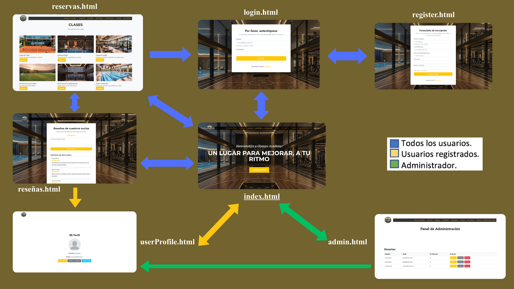

> The user can access all sections from the homepage through the navigation bar/menu. An anonymous user will only have access to public pages and will not be able to access the admin panel or user profile. To access the user profile and, consequently, book classes/facilities, leave reviews, or edit their user profile, it is necessary to first register or log in on the respective page. Once logged in as an academy user, they will be able to carry out the activities mentioned above. On the other hand, the administrator can access their panel from the main page, where they can perform any privileged activity.

NOTE: Not all arrows have been added to the diagram, but from the admin panel you can access all the pages of the website.

### **Capturas de Pantalla y Descripción de Páginas**

#### **1. Pagina Principal/ Home**


> Homepage that displays information about the academy, its team and the available facilities. Includes a navigation bar and access to registration/login for unauthenticated users.

#### **2. Reseñas**
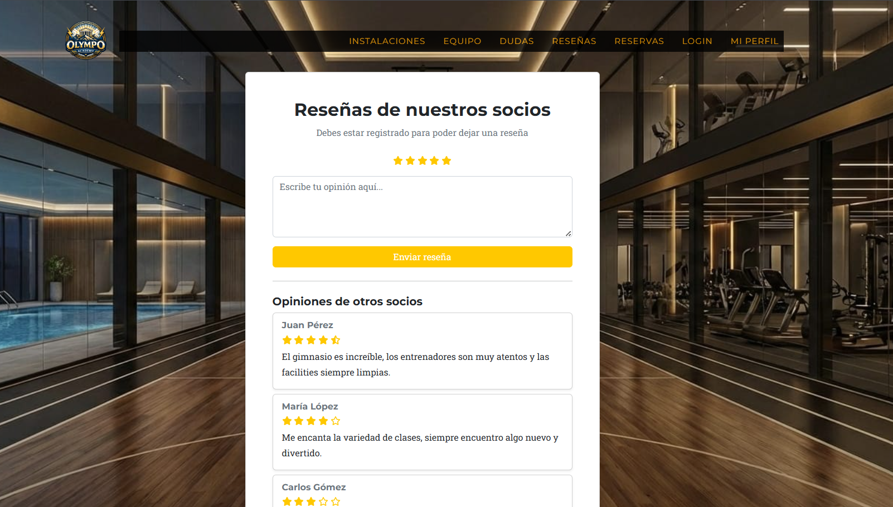

> User reviews/rating page. To add a new review, you must be logged in to the website with your credentials.

#### **3. Reservas**


> Booking page, only available to registered users. Allows you to book both a class and a facility.

#### **4. Login**


> Page that allows user authentication. It also has an option for anonymous users to register. It redirects to the main page since we don't know if the user wants to make a purchase or not.

#### **5. Registro**
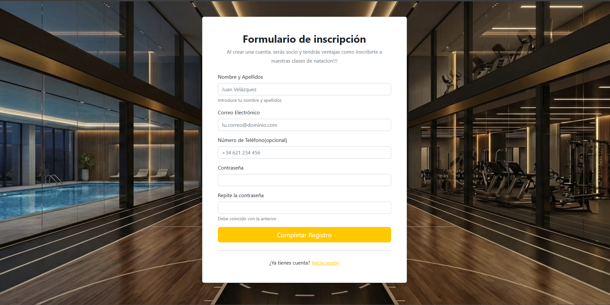

> This page allows new users to become members, who will need to fill out a form with the requested information. Once registered, it redirects to the login page.

#### **6. Mi Perfil** 
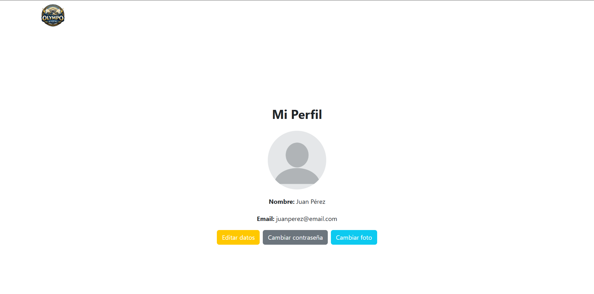

> This page is only visible to registered users. It allows you to view and edit user information (email, password, etc.), manage your bookings, and your published reviews.

#### **7. Panel del Administrador**
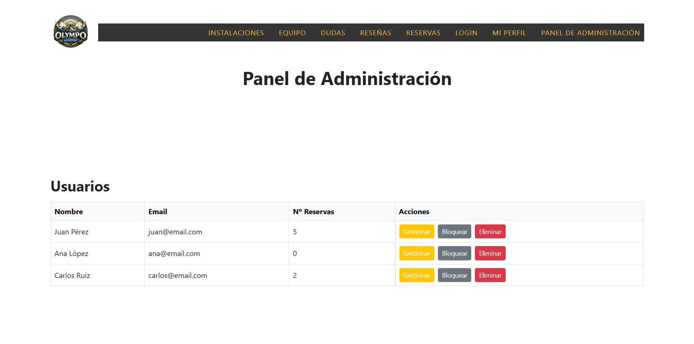

> This section is only available to the admin user, who will log in like a regular user but, as an admin, will have certain privileges such as managing users and facilities.

### **Participación de Miembros en la Práctica 1**

#### **Alumno 1 - Javier González Alonso**

| Nº    | Commits      | Files      |
|:------------: |:------------:| :------------:|
|1| [Login page development](https://github.com/DWS-2026/project-grupo-10/commit/d44805e27d613523526033a1c20576fb72c97e14)  | [login.html](https://github.com/DWS-2026/project-grupo-10/blob/main/login.html)   |
|2| [Register page development](https://github.com/DWS-2026/project-grupo-10/commit/d44805e27d613523526033a1c20576fb72c97e14)  | [register.html](https://github.com/DWS-2026/project-grupo-10/blob/main/register.html)   |
|3| [Creation of the footer](https://github.com/DWS-2026/project-grupo-10/commit/46418d77fc11c0e1c08b88defa9678bfc68c2b9a)  | [index.html](https://github.com/DWS-2026/project-grupo-10/blob/main/index.html)   |
|4| [Creation of the images of the facilities](https://github.com/DWS-2026/project-grupo-10/commit/0a6fa19888e67c0d6651e7a0a111a97acb9bbcc4)  | [/clases/instalaciones](https://github.com/DWS-2026/project-grupo-10/tree/main/images/instalaciones)   |
|5| [General and background styles](https://github.com/DWS-2026/project-grupo-10/commit/1ce6b5705de2a4c65aaa158c4881f18a782f0548)  | [ourStyles.css](https://github.com/DWS-2026/project-grupo-10/blob/main/ourStyles.css)   |

---

#### **Alumno 2 - Lucía Zapata Fernández**

| Nº    | Commits      | Files      |
|:------------: |:------------:| :------------:|
|1| [Booking page development](https://github.com/DWS-2026/project-grupo-10/commit/54697668d9a4375536375073fecd5745ab0d829f)  | [reservas.html](https://github.com/DWS-2026/project-grupo-10/blob/main/reservas.html)   |
|2| [Booking page pop-ups creation](https://github.com/DWS-2026/project-grupo-10/commit/afe5cc623de0bb916315ffe9e2336ad66b57845a)  | [reservas.html](https://github.com/DWS-2026/project-grupo-10/blob/main/reservas.html)   |
|3| [Booking page pop-ups styles](https://github.com/DWS-2026/project-grupo-10/commit/afe5cc623de0bb916315ffe9e2336ad66b57845a)  | [ourStyles.css](https://github.com/DWS-2026/project-grupo-10/blob/main/ourStyles.css)   |
|4| [Creation of the team section in the index](https://github.com/DWS-2026/project-grupo-10/commit/6c839d38f80224cfd6d120b948c734a244c2ad53)  | [index.html](https://github.com/DWS-2026/project-grupo-10/blob/main/index.html)   |
|5| [Creation of the images of the facilities](https://github.com/DWS-2026/project-grupo-10/commit/cc177219d663bc50905794a697f654ea65a43664)  | [/clases/instalaciones](https://github.com/DWS-2026/project-grupo-10/tree/main/images/instalaciones)   |

---

#### **Alumno 3 - Diego Consuegra Sáez**

| Nº    | Commits      | Files      |
|:------------: |:------------:| :------------:|
|1| [Admin panel page development](https://github.com/DWS-2026/project-grupo-10/commit/866ffc7d3691e754930587d98fb864f2f92e6cda)  | [admin.html](https://github.com/DWS-2026/project-grupo-10/blob/main/admin.html)   |
|2| [User profile page development](https://github.com/DWS-2026/project-grupo-10/commit/d0ee38ea7754d0009ba5cfb17400afec637bc5ee)  | [userProfile.html](https://github.com/DWS-2026/project-grupo-10/blob/main/userProfile.html)   |
|3| [Admin page pop-ups creation](https://github.com/DWS-2026/project-grupo-10/commit/7ba798192c908967b03b7b93e60e4e6b5b349c10)  | [admin.html](https://github.com/DWS-2026/project-grupo-10/blob/main/admin.html)   |
|4| [User page pop-ups creation](https://github.com/DWS-2026/project-grupo-10/commit/79efad0a03fbd01d5c0a782da41949a806cb98e5)  | [userProfile.html](https://github.com/DWS-2026/project-grupo-10/blob/main/userProfile.html)   |
|5| [Admin page and user page pop-ups styles](https://github.com/DWS-2026/project-grupo-10/commit/28082dba2e3ca435079a5cca3ccca2bf9bb62620)  | [ourStyles.css](https://github.com/DWS-2026/project-grupo-10/blob/main/ourStyles.css)  |

---

#### **Alumno 4 - Adrián Bellón de la Cruz**

| Nº    | Commits      | Files      |
|:------------: |:------------:| :------------:|
|1| [Reviews page development](https://github.com/DWS-2026/project-grupo-10/commit/12f120103a8fdcbcf54eb520eeea9f9aaae44065)  | [reseñas.html](https://github.com/DWS-2026/project-grupo-10/blob/main/rese%C3%B1as.html)   |
|2| [Facilities description and photos added to index](https://github.com/DWS-2026/project-grupo-10/commit/376fc28be5334b15294239193eb1a47b2dd103a6)  | [index.html](https://github.com/DWS-2026/project-grupo-10/blob/main/index.html)   |
|3| [Creation of modals for the facilities that allow zooming in on the images in the index](https://github.com/DWS-2026/project-grupo-10/commit/6dd316d896e1afcb4a4df9401750187c943c9f6a)  | [index.html](https://github.com/DWS-2026/project-grupo-10/blob/main/index.html)   |
|4| [About us section creation with descriptions and logos](https://github.com/DWS-2026/project-grupo-10/commit/a1e93e61f75abea645f696f3afd8c93d1b1d17c3)  | [index.html](https://github.com/DWS-2026/project-grupo-10/blob/main/index.html)   |

---

## 🛠 **Práctica 2: Web con HTML generado en servidor**

### **Vídeo de Demostración**
📹 **[Enlace al vídeo en YouTube](https://youtu.be/Yqe-NK-Feg8)**
> Video showing the main features of the web application.

### **Navegación y Capturas de Pantalla**

#### **Diagrama de Navegación**
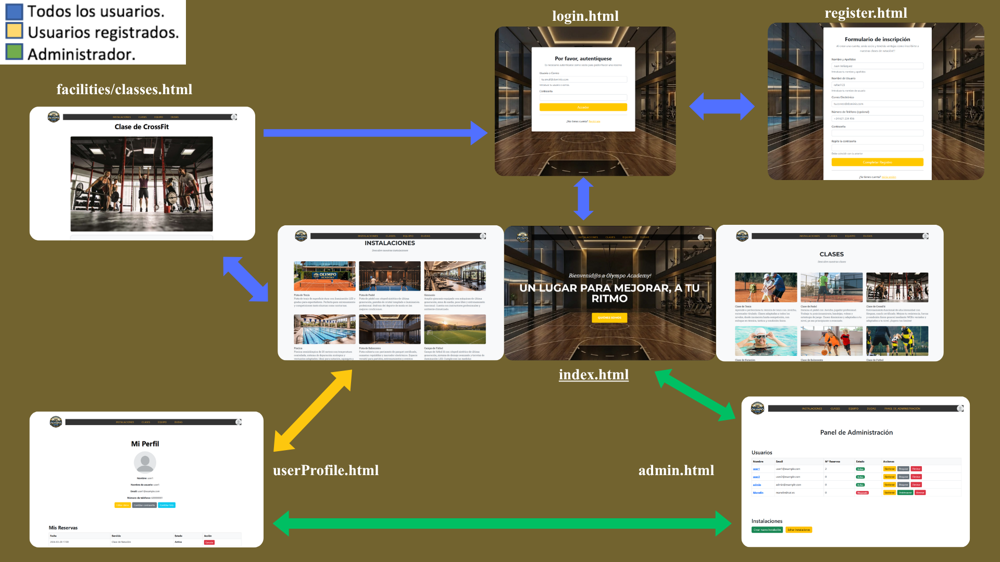

#### **Capturas de Pantalla Actualizadas**

#### **1. Pagina Principal/ Home**
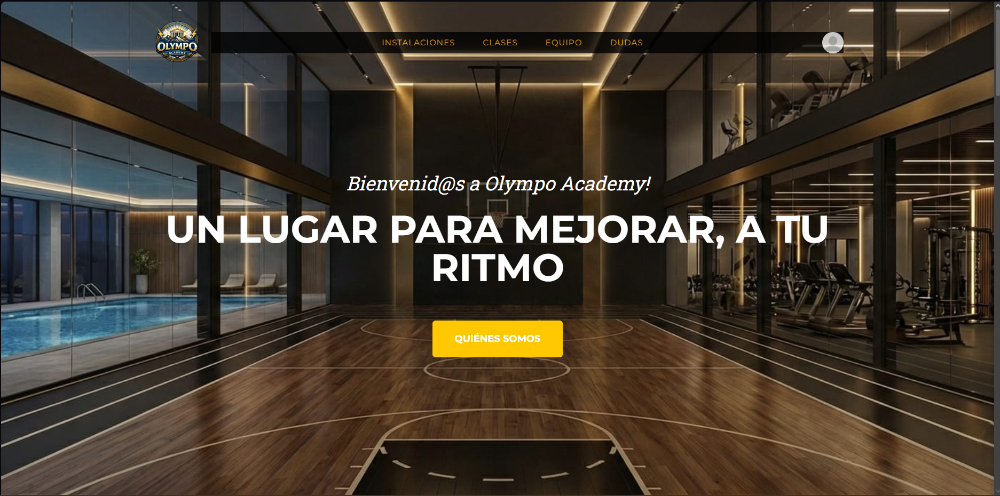

#### **2. Clases/Instalaciones**
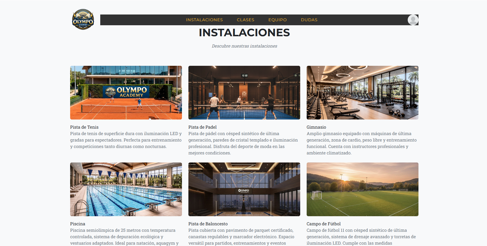
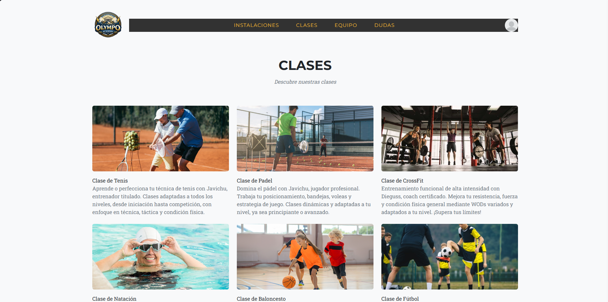

#### **3. Reservas**
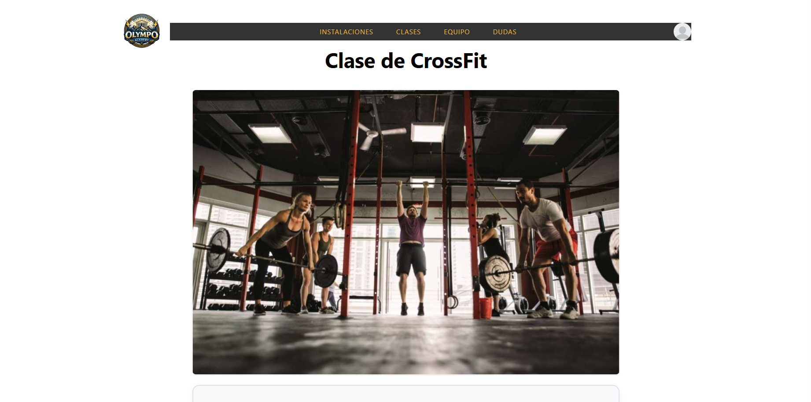
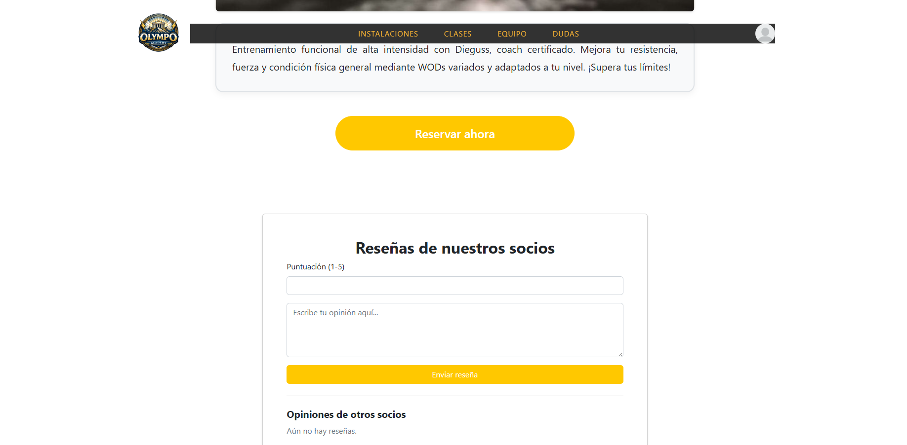

#### **4. Login**
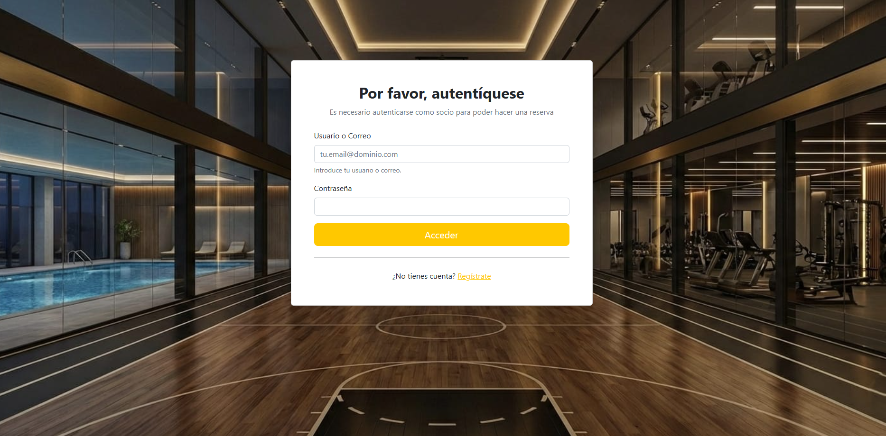

#### **5. Registro**
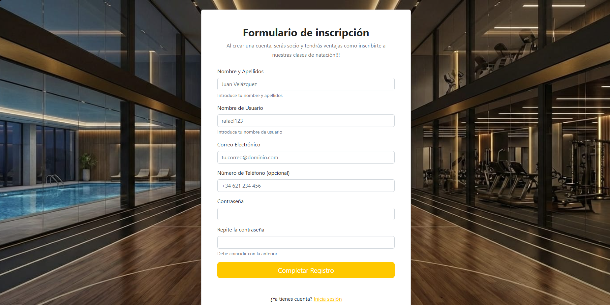

#### **6. Mi Perfil** 
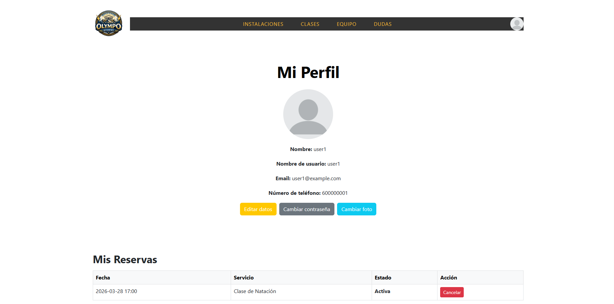

#### **7. Panel del Administrador**
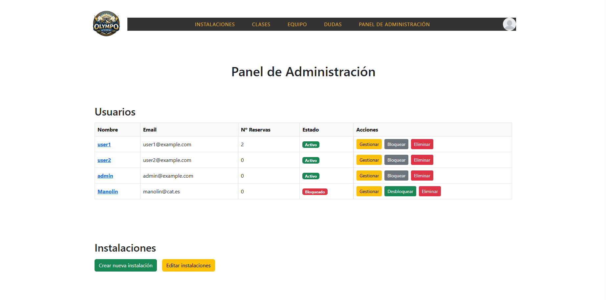

### **Instrucciones de Ejecución**

#### **Requisitos Previos**
- **Java**: versión 21 o superior
- **Maven**: versión 3.8 o superior
- **MySQL**: versión 8.0 o superior
- **Git**: para clonar el repositorio

#### **Pasos para ejecutar la aplicación**

1. **Clonar el repositorio**
   ```bash
   git clone https://github.com/DWS-2026/project-grupo-10.git
   cd project-grupo-10
   ```

2. **Crear la base de datos en MySQL**
   ```bash
   CREATE DATABASE olympo_academy_db;
   ```

3. **Ejecutar la aplicación**
   ```bash
   ./mvnw spring-boot:run
   ```

4. **Abrir en el navegador**
   ```bash
   https://localhost:8443
   ```

#### **Credenciales de prueba**
- **Usuario Admin**: usuario: `admin`, email: `admin@example.com`, contraseña: `potato`
- **Usuario Registrado 1**: usuario: `user1`, email: `user1@example.com`, contraseña: `user1`
- **Usuario Registrado 2**: usuario: `user2`, email: `user2@example.com`, contraseña: `user2`

### **Diagrama de Entidades de Base de Datos**

Diagrama mostrando las entidades, sus campos y relaciones:

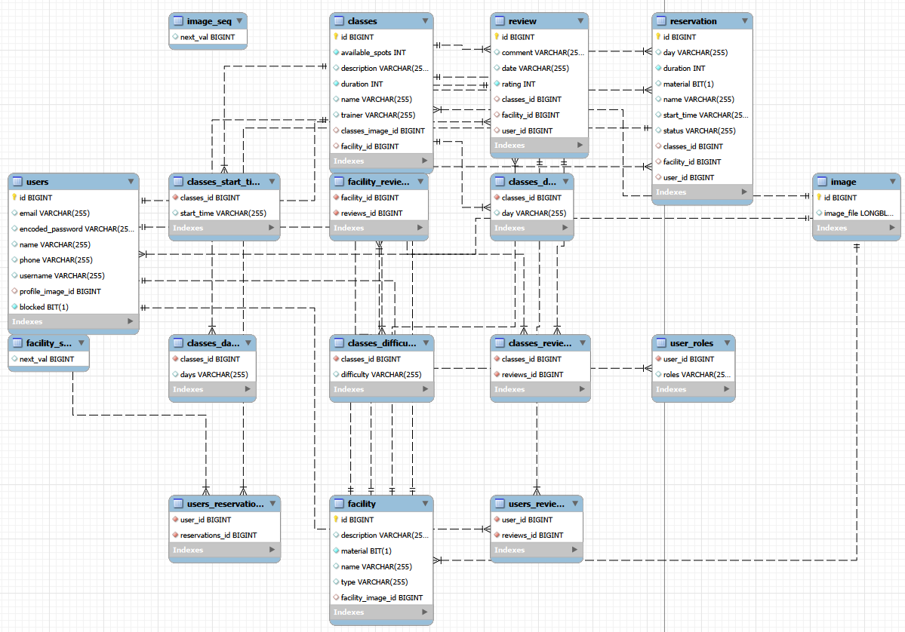

### **Diagrama de Clases y Templates**

Diagrama de clases de la aplicación con diferenciación por colores o secciones:

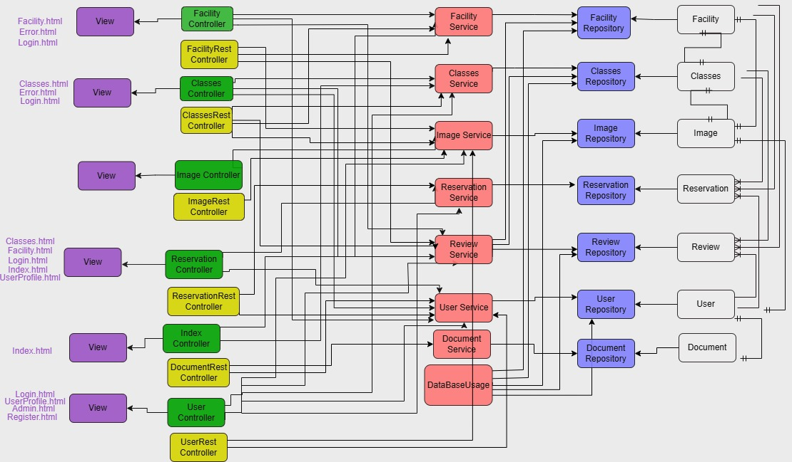

### **Participación de Miembros en la Práctica 2**

#### **Alumno 1 - Javier González Alonso**

| Nº    | Commits      | Files      |
|:------------: |:------------:| :------------:|
|1| [Login and register page functionality](https://github.com/DWS-2026/project-grupo-10/commit/73789f06713ea048ff46822e2283fb82597c9c03)  | [UserController](https://github.com/DWS-2026/project-grupo-10/blob/main/src/main/java/grupo10/olympo_academy/controller/UserController.java)   |
|2| [Website security](https://github.com/DWS-2026/project-grupo-10/commit/4d0bf7d94732c6ba66686bf3bc3baac312485756)  | [/security](https://github.com/DWS-2026/project-grupo-10/tree/main/src/main/java/grupo10/olympo_academy/security)   |
|3| [User profile functionalities development](https://github.com/DWS-2026/project-grupo-10/commit/74cadc3db31504131e24403fa6606ba1ad856b77)  | [UserController](https://github.com/DWS-2026/project-grupo-10/blob/main/src/main/java/grupo10/olympo_academy/controller/UserController.java)   |
|4| [Username login and password checker implementation](https://github.com/DWS-2026/project-grupo-10/commit/92139952b3bb6ceb4fa85a8cb0f2b1c8c524ecf0)  | [passwordChecker.js](https://github.com/DWS-2026/project-grupo-10/blob/main/src/main/resources/static/js/passwordChecker.js)   |
|5| [Doubts form and HTTPS addition](https://github.com/DWS-2026/project-grupo-10/commit/7dd2b7713511ab4875b8075b4b2a9d02480fd534)  | [index.html](https://github.com/DWS-2026/project-grupo-10/blob/main/src/main/resources/templates/index.html)   |

---

#### **Alumno 2 - Lucía Zapata Fernández**

| Nº    | Commits      | Files      |
|:------------: |:------------:| :------------:|
|1| [Classes detail page development ](https://github.com/DWS-2026/project-grupo-10/commit/4f442b437a553ac59aa91bd6e2e420790d511c08)  | [ClassesController](https://github.com/DWS-2026/project-grupo-10/blob/main/src/main/java/grupo10/olympo_academy/controller/ClassesController.java)   |
|2| [Facility detail page development](https://github.com/DWS-2026/project-grupo-10/commit/beb3182019f0d2e79ea7af13a932b5ea1096dbd4)  | [FacilityController](https://github.com/DWS-2026/project-grupo-10/blob/main/src/main/java/grupo10/olympo_academy/controller/FacilityController.java)   |
|3| [Error page development](https://github.com/DWS-2026/project-grupo-10/commit/44dd8f569b53612602a20800ff219b16fb791f2c)  | [error.html](https://github.com/DWS-2026/project-grupo-10/blob/main/src/main/resources/templates/error.html)   |
|4| [Data base usage development](https://github.com/DWS-2026/project-grupo-10/commit/9cbe946067d8c57cf2579cf3604e9df21fc643ec)  | [DataBaseUsage](https://github.com/DWS-2026/project-grupo-10/blob/main/src/main/java/grupo10/olympo_academy/DataBaseUsage.java)   |
|5| [Image entity creation](https://github.com/DWS-2026/project-grupo-10/commit/bbf21c0272adf8ad44b9d6014335a11b13e5adbe)  | [ImageController](https://github.com/DWS-2026/project-grupo-10/blob/main/src/main/java/grupo10/olympo_academy/controller/ImageController.java)   |

---

#### **Alumno 3 - Diego Consuegra Sáez**

| Nº    | Commits      | Files      |
|:------------: |:------------:| :------------:|
|1| [Facilities functionalities for admin](https://github.com/DWS-2026/project-grupo-10/commit/592274cc878a0f60b10d59fd22120a9b6d2ec279)  | [UserController](https://github.com/DWS-2026/project-grupo-10/blob/main/src/main/java/grupo10/olympo_academy/controller/UserController.java)   |
|2| [Classes functionalities for admin](https://github.com/DWS-2026/project-grupo-10/commit/459f2abc77c904f9ca701c1f4faa600831adeafc)  | [UserController](https://github.com/DWS-2026/project-grupo-10/blob/main/src/main/java/grupo10/olympo_academy/controller/UserController.java)   |
|3| [Edit and delete users from admin panel functionality](https://github.com/DWS-2026/project-grupo-10/commit/ce039f213ecb89ed6fe5e8bf4e9dde138e652fc4)  | [UserController](https://github.com/DWS-2026/project-grupo-10/blob/main/src/main/java/grupo10/olympo_academy/controller/UserController.java)   |
|4| [Navigation between users from admin panel functionality](https://github.com/DWS-2026/project-grupo-10/commit/cf949c58400899af27871a270f191b9c9ef34fc3)  | [UserController](https://github.com/DWS-2026/project-grupo-10/blob/main/src/main/java/grupo10/olympo_academy/controller/UserController.java)   |

---

#### **Alumno 4 - Adrián Bellón de la Cruz**

| Nº    | Commits      | Files      |
|:------------: |:------------:| :------------:|
|1| [Reviews functionality](https://github.com/DWS-2026/project-grupo-10/commit/ee1d600c861ee25bb04c4fdefc1dd9700698dc51)  | [Facility - Classes Controller](https://github.com/DWS-2026/project-grupo-10/blob/main/src/main/java/grupo10/olympo_academy/controller/FacilityController.java)   |
|2| [Classes and facilities reservation functionality](https://github.com/DWS-2026/project-grupo-10/commit/5f17d6a276ed9b3cd0546a1dd9d275516aa837fd)  | [ReservationController](https://github.com/DWS-2026/project-grupo-10/blob/main/src/main/java/grupo10/olympo_academy/controller/ReservationController.java)   |
|3| [Reservation restrictions](https://github.com/DWS-2026/project-grupo-10/commit/c2394d3e6450827644536e391f5650a1ead0479a)  | [ReservationController](https://github.com/DWS-2026/project-grupo-10/blob/main/src/main/java/grupo10/olympo_academy/controller/ReservationController.java)   |
|4| [Cart development and functionality](https://github.com/DWS-2026/project-grupo-10/commit/5f17d6a276ed9b3cd0546a1dd9d275516aa837fd)  | [GlobalModelAttributes](https://github.com/DWS-2026/project-grupo-10/blob/main/src/main/java/grupo10/olympo_academy/config/GlobalModelAttributes.java)   |

---

## 🛠 **Práctica 3: Incorporación de una API REST a la aplicación web, análisis de vulnerabilidades y contramedidas**

### **Vídeo de Demostración**
📹 **[Enlace al vídeo en YouTube](https://www.youtube.com/watch?v=x91MPoITQ3I)**
> Video showing the main features of the web application.

### **Documentación de la API REST**

#### **Especificación OpenAPI**
📄 **[Especificación OpenAPI (YAML)](/api-docs/api-docs.yaml)**

#### **Documentación HTML**
📖 **[Documentación API REST (HTML)](https://raw.githack.com/[usuario]/[repositorio]/main/api-docs/api-docs.html)**

> La documentación de la API REST se encuentra en la carpeta `/api-docs` del repositorio. Se ha generado automáticamente con SpringDoc a partir de las anotaciones en el código Java.

### **Diagrama de Clases y Templates Actualizado**

Diagrama actualizado incluyendo los @RestController y su relación con los @Service compartidos:


#### **Credenciales de Usuarios de Ejemplo**

| Rol | Usuario | Contraseña |
|:---|:---|:---|
| Administrador | admin | potato |
| Usuario Registrado | user1 | user1 |
| Usuario Registrado | user2 | user2|

### **Participación de Miembros en la Práctica 3**

#### **Alumno 1 - Javier González Alonso**

| Nº    | Commits      | Files      |
|:------------: |:------------:| :------------:|
|1| [REST API implementation for users](https://github.com/DWS-2026/project-grupo-10/commit/c01982dd6da80866cedc637ab498a7e6619816e1)  | [UserRestController](https://github.com/DWS-2026/project-grupo-10/blob/main/src/main/java/grupo10/olympo_academy/controllers/rest/UserRestController.java)   |
|2| [REST API implementation for images](https://github.com/DWS-2026/project-grupo-10/commit/4353f5a4b6aead91beba7e04eeb1d0bda45f7358)  | [ImageRestController](https://github.com/DWS-2026/project-grupo-10/blob/main/src/main/java/grupo10/olympo_academy/controllers/rest/ImageRestController.java)   |
|3| [Security configuration with jwt addition](https://github.com/DWS-2026/project-grupo-10/commit/2f201c8f2512fc06919ccea2b3d62b2908684762)  | [jwt](https://github.com/DWS-2026/project-grupo-10/tree/main/src/main/java/grupo10/olympo_academy/security/jwt)   |
|4| [Pagination in REST API implementation](https://github.com/DWS-2026/project-grupo-10/commit/5c03b68d431fc5f78c0d0bbaf618db2fd45eb6d2)  | [ClassesRestController](https://github.com/DWS-2026/project-grupo-10/blob/main/src/main/java/grupo10/olympo_academy/controllers/rest/ClassesRestController.java)<br>[FacilityRestController](https://github.com/DWS-2026/project-grupo-10/blob/main/src/main/java/grupo10/olympo_academy/controllers/rest/FacilityRestController.java) |   
|5| [Descripción commit 5](URL_commit_5)  | [Archivo5](URL_archivo_5)   |

---

#### **Alumno 2 - Lucía Zapata Fernández**

| Nº    | Commits      | Files      |
|:------------: |:------------:| :------------:|
|1| [REST API implementation for facilities](https://github.com/DWS-2026/project-grupo-10/commit/05f03ba156dc33152cc9094ede19f1dbb07627f2)  | [FacilityRestController](https://github.com/DWS-2026/project-grupo-10/blob/main/src/main/java/grupo10/olympo_academy/controllers/rest/FacilityRestController.java)   |
|2| [REST API implementation for reviews](https://github.com/DWS-2026/project-grupo-10/commit/6a31d437b3cf2621a6e789d9e664911da5fc926a)  | [ClassesRestController](https://github.com/DWS-2026/project-grupo-10/blob/main/src/main/java/grupo10/olympo_academy/controllers/rest/ClassesRestController.java)<br>[FacilityRestController](https://github.com/DWS-2026/project-grupo-10/blob/main/src/main/java/grupo10/olympo_academy/controllers/rest/FacilityRestController.java)|
|3| [Descripción commit 3](URL_commit_3)  | [Archivo3](URL_archivo_3)   |
|4| [Descripción commit 4](URL_commit_4)  | [Archivo4](URL_archivo_4)   |
|5| [Descripción commit 5](URL_commit_5)  | [Archivo5](URL_archivo_5)   |

---

#### **Alumno 3 - Diego Consuegra Sáez**

| Nº    | Commits      | Files      |
|:------------: |:------------:| :------------:|
|1| [REST API implementation for classes](https://github.com/DWS-2026/project-grupo-10/commit/65ece63b33b01f79fd52ed8125a4a2ac74da091f)  | [ClassesRestController](https://github.com/DWS-2026/project-grupo-10/blob/main/src/main/java/grupo10/olympo_academy/controllers/rest/ClassesRestController.java)   |
|2| [REST API implementation for admin](https://github.com/DWS-2026/project-grupo-10/commit/4e8d09eee52a069a425607b44d6c967995f7b9f6)  | [UserRestController](https://github.com/DWS-2026/project-grupo-10/blob/main/src/main/java/grupo10/olympo_academy/controllers/rest/UserRestController.java)   |
|3| [Descripción commit 3](URL_commit_3)  | [Archivo3](URL_archivo_3)   |
|4| [Descripción commit 4](URL_commit_4)  | [Archivo4](URL_archivo_4)   |
|5| [Descripción commit 5](URL_commit_5)  | [Archivo5](URL_archivo_5)   |

---

#### **Alumno 4 - Adrián Bellón de la Cruz**

| Nº    | Commits      | Files      |
|:------------: |:------------:| :------------:|
|1| [Rich text field addition](https://github.com/DWS-2026/project-grupo-10/commit/55b139c5a5b748c827731d8d6f8df058e0495502)  | [admin.html](https://github.com/DWS-2026/project-grupo-10/commit/55b139c5a5b748c827731d8d6f8df058e0495502#diff-ab23a499fae2f6f07ede1e5e3ccb0a449a1bfe25a38f21fdc5344fee38914598)   |
|2| [REST API implementation for reservations](https://github.com/DWS-2026/project-grupo-10/commit/0b1cad331ba6d31bb5f99137136cab9d2353a048)  | [ReservationRestController](https://github.com/DWS-2026/project-grupo-10/blob/main/src/main/java/grupo10/olympo_academy/controllers/rest/ReservationRestController.java)   |
|3| [Document management with file storage on disk implementation](https://github.com/DWS-2026/project-grupo-10/commit/776f7c1cf5e56b19738129ed281e989fa26dfdb5)  | [DocumentRestController](https://github.com/DWS-2026/project-grupo-10/blob/main/src/main/java/grupo10/olympo_academy/controllers/rest/DocumentRestController.java)<br>[UserController](https://github.com/DWS-2026/project-grupo-10/blob/main/src/main/java/grupo10/olympo_academy/controllers/web/UserController.java)|
|4| [Secure file upload validation and stored XSS prevention](https://github.com/DWS-2026/project-grupo-10/commit/53e34aa549ae8f80aec80984c6dcfcac67b4203f)  | [DocumentService](https://github.com/DWS-2026/project-grupo-10/blob/main/src/main/java/grupo10/olympo_academy/services/DocumentService.java)   |
|5| [Descripción commit 5](URL_commit_5)  | [Archivo5](URL_archivo_5)   |
